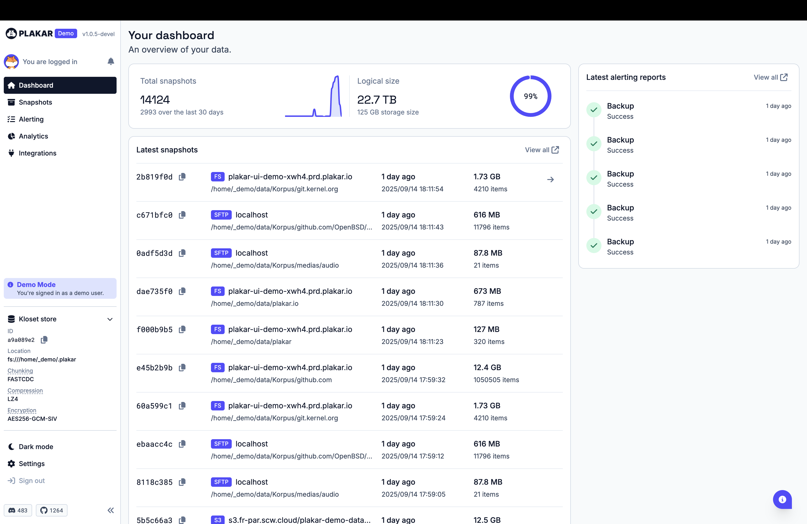
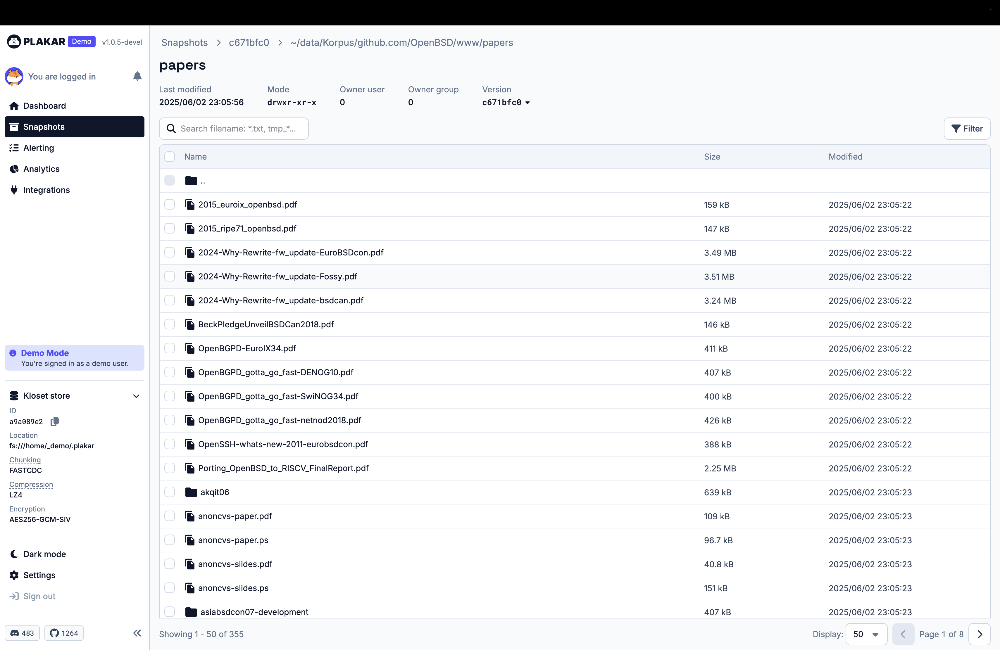
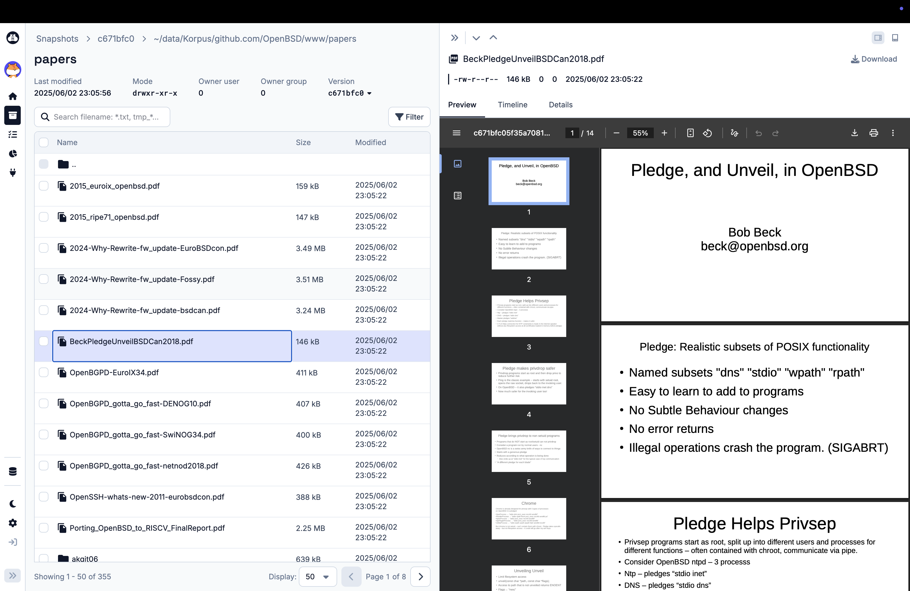
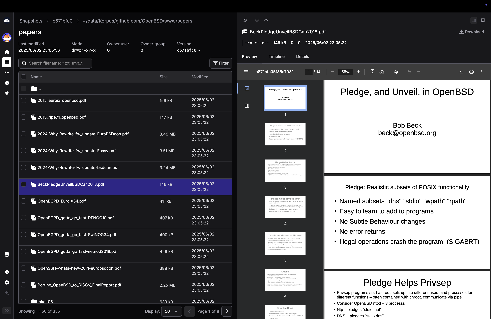

It’s been a while — but we haven’t been idle.  

Today we’re proud to announce **Plakar v1.0.4**, a stable release that reflects months of refinement, community input, and nearly **2,000 commits** of engineering effort.  

This release is more than just an update — it’s a **milestone**. It introduces major performance boosts, redefines how integrations are delivered, and lays down the foundation for a new class of features that will shape Plakar’s future.  


---

## Pre-packaged binaries: install without friction  

Building from source has always been a barrier for many users — whether due to missing toolchains, mismatched dependencies, or simply the time it takes.  

Starting today, **that barrier is gone**.  

We now ship **pre-packaged binaries** for popular systems and distributions:  

- `.deb` for Debian/Ubuntu  
- `.rpm` for Fedora, CentOS, RHEL  
- `.apk` for Alpine Linux  
- Plus static tarballs for everything else  

At launch, you can grab them from our [GitHub releases page](https://github.com/PlakarKorp/plakar).  

Later this week, we’ll go one step further: official package repositories. This means you’ll be able to install or update Plakar with a single `apt`, `yum`, or `apk` command — keeping your deployments simpler, cleaner, and always up-to-date.  

This is a big step toward making Plakar **accessible to everyone, everywhere**.  


---

## Initial Windows support

We are bringing initial support for Windows.

The only limitation that we know of is that agent and scheduler aren't supported,
as unlike unix-like systems these require to implement Windows Service for background tasks,
which is something we didn't get the time to complete.

So you can run plakar on Windows,
perform backups, checks, restores and even run the UI,
but you can't complete two operations in parallel at this time.

Regardless,
it is a huge milestone considering that our previous version didn't built on Windows.


---

## Integrations as plugins: leaner, faster, more flexible  

One of the biggest changes in this release is the new **plugin system**.  

Integrations — for storage, source and destinations — are no longer tied directly into the core of Plakar.  

Instead, they are delivered as independent **plugins** that you can install on demand:  


```sh
plakar pkg add <integration>

ie:
plakar pkg add s3
plakar pkg add sftp
...
```

This shift brings three major benefits:  

1. **Lightweight core** — Plakar ships leaner, with fewer dependencies baked in.  
2. **Independent releases** — plugins can evolve and be updated faster, without waiting for a full Plakar release.  
3. **Extensibility** — building and distributing new integrations becomes easier, encouraging contributions from the community.  

With v1.0.4, we’re officially rolling out this plugin system — and many integrations (S3, SFTP, GCP, IMAP, FTP, ...) are already available.  


--- 


## Smarter agent: auto-spawn & teardown  

Concurrency in Plakar requires a local cache. Until now, this meant manually starting the `plakar agent` before running commands. Forgetting to do so was one of the most common pitfalls — and a frustrating one.  

That era is over.  

From now on, the **agent manages itself**:  

- It auto-spawns when needed.  
- It auto-tears down after a short idle period.  
- It never hangs around in the background unless required.  

This might sound like a small change, but in practice it **completely removes friction**. It’s the first step toward a future where you don’t have to think about concurrency or agents at all — Plakar will simply handle it for you.  


---


## Cache improvements: smarter, not noisier  

Caching is at the heart of Plakar’s speed. But caching too aggressively could sometimes mean wasted resources in large datasets.

We’ve tuned and refined our strategy.  

The new cache layer is **smarter, less intrusive, and more accurate**. For example, in our test Korpus with over **1 million resources**, the new approach reduced unnecessary lookups while improving accuracy and keeping memory usage under control.  

The result: faster operations that feel lighter and more predictable.

There are still corner cases where we cache too agressively and that we need to work on,
but **v1.0.4** already halves cache storage space for most setups and performs far less disk hits for cache lookups and writes, putting less pressure on disk I/O.


---

## Performance boosts: speed everywhere  

We’ve poured countless hours into **profiling and optimizing** every corner of Plakar.  

Some of the highlights:  

- Faster **indexing** of snapshots
- More efficient **filesystem traversal**
- More efficient **file content** access
- Optimized **deduplication pipelines**
- Lower **memory footprint** across the board  

These changes combine to make commands like `plakar backup`, `plakar check`, and `plakar restore` noticeably faster — especially in large-scale environments.

Details will follow in a dedicated technical post, but the difference is already tangible: **Plakar simply feels faster**. Some commands get a x2 boost, others up to a x10 boost, due to much improved data access patterns.

---

## Policy support: control how data lives  

With v1.0.4, Plakar introduces **policy definitions**.  

This means you can now define rules that govern how data is stored, managed, and eventually pruned.  

For now, policies are simple — but they open the door to advanced features such as:  

- **Tiered storage** (e.g. SSD for hot data, object storage for cold data)  
- **Automatic pruning** based on age, size, or frequency  
- **Smarter scheduling** of backups and syncs  

Think of policies as the scaffolding for **enterprise-grade data lifecycle management** inside Plakar.

Currently policies will allow you to do things like keep 2 backups per month over the last three months +
5 backup per week over the last four weeks + 3 per day over the last 2 days:
```
$ plakar prune -days 2 -per-day 3 -weeks 4 -per-week 5 -months 3 -per-month 2
```

But it also support filering on all our snapshot locating options,
like filtering on tags:
```
$ plakar prune -tags finance -per-day 5
```


---
## UI improvements: details that matter  

Not everything in v1.0.4 is flashy — some of the most impactful changes are in the everyday experience.  

For this release, we went beyond functional tweaks: **we partnered with a design studio** to rethink Plakar’s look and feel. The result is a cleaner, more consistent, and more approachable interface that makes everyday usage smoother.  

Some highlights include:  

- **Refined layouts** that present information in a way that feels more natural and easier to scan  
- **Consistent typography and spacing**, improving readability for long-running commands  
- **Clearer visual hierarchy** in progress reporting, so you can immediately see what matters  
- **Better error messages**, rewritten to be actionable and friendly rather than cryptic  

The collaboration brought in fresh eyes from outside the engineering team, ensuring the interface wasn’t just technically correct but also **pleasant to use**.  

These changes may feel small individually, but together they deliver a more polished **user experience**. Plakar now feels less like a raw developer tool and more like a thoughtfully designed product — without losing the power and flexibility that make it unique.  

You can have a peak at it on our [demo website](https://demo.plakar.io),
but here's a few screenshots for you.






--- 

## Call to action

And this is just the beginning.  

We’re already working on the next wave of features: richer integrations, deeper policy engines, more UI improvements, and better cross-platform support.  

But we need you:  

- ⭐ [Star us on GitHub](https://github.com/PlakarKorp/plakar)  
- 💬 [Join the chat on Discord](https://discord.com/invite/uqdP9Wfzx3)  
- 🚀 Try the new release, push it to its limits, and tell us what you think of it !  

This is your Plakar as much as it is ours. Let’s keep building it together :-)  
